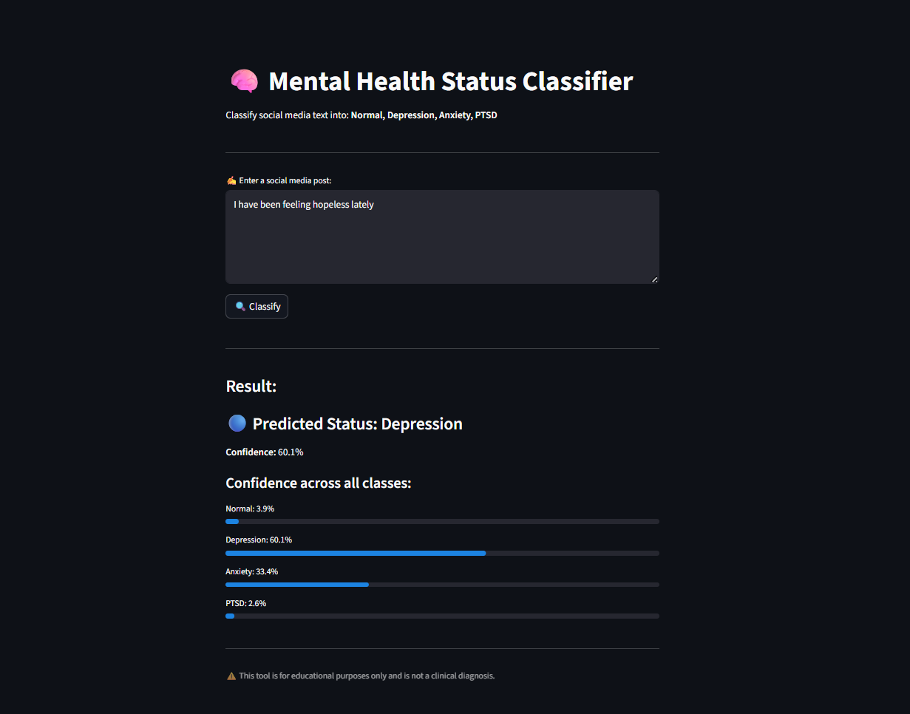

# Project Title: Mental Health Status Classification from Social Media Text

## Team Members

| Name | Reg No | Course |
| --- | --- | --- |
| Swetha Babu| 254122 | Msc Data Analytics with Specialization in Computational Science|
| Sebin George | 253309 | Msc DataScience and Geoinformatics |
| Arun P S| 253206 | MSc DataScience and BioAI |

---

## 👥 Team

| Member | Role |
|--------|------|
| Swetha Babu | | Swetha Babu | Responsible for data collection and preprocessing. Collected Reddit posts from depression, anxiety, PTSD, and normal subreddits. Cleaned text by removing URLs, special characters, and stopwords. Anonymized data to remove PII and handled ethical and privacy concerns. Produced the cleaned labeled dataset for model training. ||
| Sebin George | Responsible for model building and training pipeline development. Implemented a baseline machine learning model using TF-IDF vectorization combined with Support Vector Machine (SVM) for text classification. Developed and fine-tuned a BERT-based sequence classification model for improved contextual understanding of mental health-related text. Performed stratified train-test splitting to ensure balanced class distribution across depression, anxiety, PTSD, and normal categories. Trained and validated both SVM and BERT models, then generated and saved prediction outputs as y_pred_svm.npy and y_pred_bert.npy for downstream evaluation. Managed preprocessing, tokenization, feature extraction, and model training workflows. Exported trained model artifacts and prediction files for integration with the evaluation and comparison module. |
| Arun | Responsible for model evaluation and comparison. Loaded trained model outputs (y_test.npy, y_pred_svm.npy, y_pred_bert.npy) and performed comprehensive evaluation of both SVM and BERT models. Computed per-class metrics including sensitivity (recall), specificity, precision, and F1-score for all four categories — depression, anxiety, PTSD, and normal — using sklearn's classification_report. Generated side-by-side confusion matrix heatmaps for visual comparison of both models and saved them as confusion_matrices.png. Produced an evaluation summary table (evaluation_summary.csv) comparing both models on Accuracy, Macro F1, and Weighted F1. BERT achieved 85.7% accuracy vs SVM's 82.2%, with BERT showing the most improvement in the anxiety and normal classes. Authored a detailed discussion write-up (discussion.md) covering early intervention use cases and ethical risks including misclassification harm, privacy concerns, data bias, and surveillance misuse. Uploaded all evaluation files to the GitHub repository. |

---

## Problem Statement

Mental health conditions such as depression, anxiety, and PTSD are increasingly reflected in social media activity. With millions of users sharing their emotional experiences on platforms like Reddit and Twitter, there is a significant opportunity to use Natural Language Processing (NLP) to detect early signs of mental health struggles at scale.

This project aims to build a robust classification system that can automatically categorize social media posts into four mental health categories: **Depression**, **Anxiety**, **PTSD**, and **Normal**, using both traditional machine learning and state-of-the-art transformer-based approaches.

The project addresses the complete data science lifecycle including:

- Data collection and preprocessing with privacy considerations
- Feature extraction using TF-IDF and BERT embeddings
- Model development and fine-tuning
- Evaluation using sensitivity, specificity, and F1-score
- Discussion of ethical risks and early intervention use cases

---

## Objectives

- Classify social media posts into Depression, Anxiety, PTSD, and Normal categories
- Perform text preprocessing with anonymization and ethical data handling
- Build and compare TF-IDF + SVM baseline with fine-tuned BERT model
- Evaluate models using sensitivity, specificity, F1-score, and confusion matrices
- Discuss real-world potential for early mental health intervention tools
- Address privacy, consent, and ethical risks of deploying such systems

---

## Dataset

- **Source:** Reddit posts across mental health-related subreddits
- **Categories:** Depression, Anxiety, PTSD, Normal
- **Total Test Samples:** 2,060

### Key Columns

- `text` — Social media post content
- `label` — Mental health category (depression / anxiety / PTSD / normal)

### Label Mapping

| Label | Category |
| --- | --- |
| 0 | Depression |
| 1 | Anxiety |
| 2 | PTSD |
| 3 | Normal |

---

## Methodology

### 1. Data Collection & Preprocessing 

- Collected Reddit posts from depression, anxiety, PTSD, and normal subreddits
- Cleaned text: removed URLs, special characters, and stopwords
- Anonymized data to remove personally identifiable information
- Handled ethical and privacy concerns
- Output: cleaned labeled dataset

---

### 2. Model Building 

- **Baseline:** TF-IDF vectorization + Support Vector Machine (SVM)
- **Deep Learning:** Fine-tuned BERT for sequence classification
- Train-test split with stratification
- Saved predictions as y_pred_svm.npy and y_pred_bert.npy
- Output: trained models and predictions

---

### 3. Model Evaluation

- Loaded saved predictions
- Computed per-class sensitivity, specificity, precision, and F1-score
- Generated confusion matrices for both models
- Compared BERT vs SVM performance
- Authored discussion on early intervention use cases and ethical risks

---

## Results & Comparison

| Model | Accuracy | Macro F1 | Weighted F1 |
| --- | --- | --- | --- |
| TF-IDF + SVM | 82.2% | 0.821 | 0.821 |
| BERT (fine-tuned) | 85.7% | 0.857 | 0.857 |

**Best Model: BERT with 85.7% accuracy and Macro F1 of 0.857** 🏆

---


## Model Performance Summary

### TF-IDF + SVM

1. **Accuracy:** 82.2%
2. **Macro F1:** 0.821
3. **Strengths:** Fast training, interpretable, works well with high-dimensional sparse text features.
4. **Weakest Class:** Normal (73% recall — many normal posts misclassified as depression or anxiety)

### BERT (fine-tuned)

1. **Accuracy:** 85.7%
2. **Macro F1:** 0.857
3. **Strengths:** Understands sentence context and nuance. Biggest improvement over SVM in anxiety and normal classes.
4. **Weakest Class:** Normal (81% recall — improved significantly over SVM)

---

## Per-Class Confusion Matrix Results

### SVM Confusion Matrix

| Actual \ Predicted | Depression | Anxiety | PTSD | Normal |
| --- | --- | --- | --- | --- |
| **Depression** | 450 | 17 | 23 | 25 |
| **Anxiety** | 27 | 416 | 33 | 39 |
| **PTSD** | 12 | 10 | 453 | 40 |
| **Normal** | 52 | 49 | 40 | 374 |

### BERT Confusion Matrix

| Actual \ Predicted | Depression | Anxiety | PTSD | Normal |
| --- | --- | --- | --- | --- |
| **Depression** | 446 | 33 | 10 | 26 |
| **Anxiety** | 15 | 458 | 14 | 28 |
| **PTSD** | 7 | 29 | 441 | 38 |
| **Normal** | 30 | 50 | 15 | 420 |

---

## Evaluation Files

| File | Description |
| --- | --- |
| `Comparison_code.ipynb` | Full evaluation notebook with metrics and charts |
| `confusion_matrices.png` | Side-by-side SVM and BERT confusion matrix heatmaps |
| `evaluation_summary.csv` | Accuracy and F1 comparison table |
| `discussion.md` | Write-up on early intervention use cases and ethical risks |

---

## Ethical Considerations

- Social media users did not explicitly consent to mental health classification
- Misclassification of normal posts can lead to unnecessary stigmatization
- Training data may be biased toward certain demographics or cultural backgrounds
- Risk of misuse for surveillance by employers or governments
- Model should only assist human reviewers — never replace clinical diagnosis
- Full discussion available in `discussion.md`

---

## Conclusion

This project demonstrates that NLP models, particularly fine-tuned BERT, can classify mental health conditions from social media text with strong accuracy (85.7%). The system shows real potential as an early intervention tool to flag at-risk posts for human review. However, accuracy alone is not sufficient for real-world deployment — ethical safeguards, human oversight, and data privacy protections are essential. BERT outperforms the SVM baseline by 3.5% across all metrics, with the most significant gains in the anxiety and normal categories.

---

## Repository Structure

```
Mental-Health-Status-Classification-from-Social-Media-Text/
│
├── Comparison_code.ipynb         # Member C: evaluation notebook
├── Model_Building.ipynb          # Member B: model training notebook
├── code.ipynb                    # Member A: preprocessing notebook
├── confusion_matrices.png        # Member C: confusion matrix plots
├── evaluation_summary.csv        # Member C: accuracy and F1 summary
├── discussion.md                 # Member C: ethical risks and use cases
├── model_comparison_val.csv      # Member B: validation comparison
├── y_pred_bert.npy               # Member B: BERT predictions
├── y_pred_svm.npy                # Member B: SVM predictions
├── y_test.npy                    # Member B: true test labels
└── README.md
```

## 🚀 Deployment

The app is live at:

🔗 [Click here to open the app](https://mental-health-status-classification-from-social-media-text-8cs.streamlit.app/)

## 🖥️ App Preview




